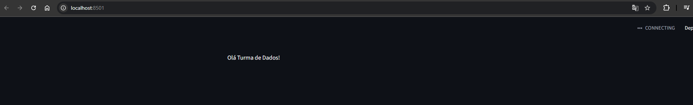
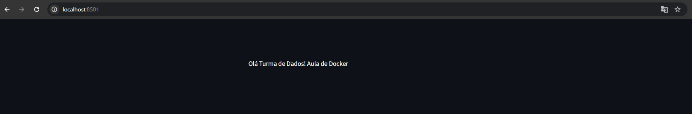

# Infra, Linux, Docker

## Introdução
Baseado no conteúdo da [Jornada de Dados](https://suajornadadedados.com.br/), com o Fundador e CEO, Luciano Vasconcelos.<br>
[Repositorio do Github](https://github.com/lvgalvao/workshop-docker-aovivo-)<br>
[Excalidraw](https://app.excalidraw.com/l/8pvW6zbNUnD/6MNAkqnvTPt)

## Docker
### Por que usar Docker?
- Facilita a criação, o deploy e a execução de aplicações usando containers.
- Permite que você empacote uma aplicação com todas as partes necessárias, como bibliotecas e outras dependências, e envie tudo como um único pacote.
- Garante que a aplicação funcione em qualquer outro ambiente, independentemente das configurações do sistema operacional ou das dependências instaladas
- Isolamento: Cada container é isolado dos outros, o que significa que você pode executar múltiplas aplicações no mesmo host sem conflitos.
- Portabilidade: Containers podem ser executados em qualquer lugar, desde o laptop de um desenvolvedor até servidores na nuvem.
- Eficiência: Containers compartilham o kernel do sistema operacional, o que os torna mais leves e rápidos do que máquinas virtuais tradicionais.
- Escalabilidade: Facilita o escalonamento de aplicações, permitindo que você aumente ou diminua o número de containers conforme a demanda.
- Consistência: Garante que a aplicação funcione da mesma maneira em diferentes ambientes, desde o desenvolvimento até a produção.
- Facilidade de gerenciamento: Ferramentas como Docker Compose e Kubernetes facilitam o gerenciamento de múltiplos containers e serviços.

### Histórico do Docker
- Servidores -> Caros e difíceis de escalar ($$$$)
- Motivação -> aproveitamento de recursos
- Docker Surgimento -> 2013 -> complemento a Virtualização -> Utilização do Computador da melhor forma possível.

VM + Pesada x Docker
Docker é focado em Aplicação. 

### Como Instalar o Docker?
- Linux (Ubuntu)
```bash
sudo apt-get update
sudo apt-get install \
    ca-certificates \
    curl \
    gnupg \
    lsb-release -y
sudo mkdir -p /etc/apt/keyrings
curl -fsSL https://download.docker.com/linux/ubuntu/gpg | sudo gpg --dearmor -o /etc/apt/keyrings/docker.gpg
echo "deb [arch=$(dpkg --print-architecture) signed-by=/etc/apt/keyrings/docker.gpg] https://download.docker.com/linux/ubuntu \
  $(lsb_release -cs) stable" | sudo tee /etc/apt/sources.list.d/docker.list > /dev/null
sudo apt-get update
sudo apt-get install docker-ce docker-ce-cli containerd.io docker-buildx-plugin docker-compose-plugin
```

- Windows
https://docs.docker.com/desktop/install/windows-install/

- Mac
https://docs.docker.com/desktop/install/mac-install/

### Tutorial Básico do Docker

No exemplo, o Luciano está utilizando o Docker Desktop no Windows. Aqui vou reproduzir os passos usando o Linux (Ubuntu 24.04), com uma imagem no WSL.

- Verificar a versão do Docker
```bash
docker --version
```


- Rodar um container com a imagem do welcome-to-docker
```bash
docker pull docker/welcome-to-docker
```


```bash
docker run -d -p 8080:80 docker/welcome-to-docker
```


Abra o navegador e acesse http://localhost:8080


No Docker, executa um Container e o Sistema Operacional dele é o Linux.

Para pegar outras imagens, acesse o Docker Hub: https://hub.docker.com/

- Listar os containers em execução
```bash
docker ps
```

### Hello World do Docker

1) Adicione o streamlit ao seu ambiente virtual
```bash
poetry add streamlit
```
2) Crie um arquivo chamado `app.py` com o seguinte conteúdo:
```python
import streamlit as st

def hello_world():
    return "Olá Turma de Dados! Aula de Docker"

def main():
    st.write(hello_world())

if __name__ == "__main__":
    main()
```

3) Teste a aplicação localmente
```bash
poetry run streamlit run app.py
```

Você terá um resultado parecido com este:


4) Crie um arquivo chamado `Dockerfile` com o seguinte conteúdo:
```dockerfile
FROM python:3.12 # imagem base
RUN pip install poetry # instala o poetry
COPY . /src # copia os arquivos para o container
WORKDIR /src # define o diretório de trabalho
RUN poetry install # instala as dependências
EXPOSE 8501 # expõe a porta 8501
ENTRYPOINT [ "poetry", "run", "streamlit", "run", "app.py", "--server.port=8501", "--server.address=0.0.0.0" ] # comando para rodar a aplicação
```

5) Adicione o .dockerignore
```
.venv
```

6) Construa a imagem Docker
```bash
docker build -t minha-primeira-imagem .

7) Liste as imagens Docker disponíveis
```bash
docker images
```

8) Execute o container
```bash
docker run -d -p 8501:8501 minha-primeira-imagem
``` 

9) Acesse a aplicação no navegador
Abra o navegador e acesse http://localhost:8501

Imagem da aplicação rodando no Docker:



### Informações importantes do Workshop sobre Docker

```bash
git clone ...
cd ...
```

```bash
docker build ...
docker run ...
```

### Meios de deploy - Render
<p> Há meios como o Render para fazer um deploy do Container </p>

1) Entre no site do Render: https://render.com/
2) Crie uma conta ou faça login.
3) Clique em "New" e selecione "Web Service".
4) Conecte sua conta do GitHub e selecione o repositório que contém seu Dockerfile.
5) Configure o serviço:
   - Nome do serviço
   - Região
   - Branch (geralmente "main" ou "master")
   - Dockerfile Path (caminho para o seu Dockerfile, geralmente é apenas "./Dockerfile")
   - Port (a porta que sua aplicação está escutando, no caso do Streamlit, é 8501)
6) Clique em "Create Web Service".
7) O Render irá construir a imagem Docker e iniciar o serviço. Você pode acompanhar o progresso na seção de logs.
8) Após a construção e o deploy serem concluídos, você receberá uma URL onde sua aplicação estará disponível.

### Meios de Deploy - AWS
<p> Há meios como a AWS para fazer um deploy do Container. Vamos fazer via EC2. </p>

1) Crie uma conta na AWS: https://aws.amazon.com/
2) Acesse o console de gerenciamento da AWS: https://aws.amazon.com/console/
3) Vá para o serviço EC2 (Elastic Compute Cloud).
4) Clique em "Launch Instance" para criar uma nova instância.
5) Escolha uma Amazon Machine Image (AMI). Para este exemplo, selecione "Amazon Linux 2 AMI".
6) Escolha o tipo de instância. Para testes, a t2.micro (que é elegível para o nível gratuito) é suficiente.
7) Configure key pair para acessar a instância via SSH. Se você não tiver um, crie um novo e baixe o arquivo .pem.
8) Configure o grupo de segurança para permitir o tráfego Custom TCP e a porta que sua aplicação Docker estará escutando (por exemplo, 8501 para Streamlit) e o endereço de ip 0.0.0.0/0
9) Revise e lance a instância.
10) Para conectar via ssh, no Console da AWS, selecione a instância e clique em "Connect".
11) Escolha a guia SSH client.
12) Siga as instruções para conectar via terminal. Exemplo:
```bash
chmod 400 your-key-pair.pem
```
13) Conecte-se à instância:
```bash
ssh -i "your-key-pair.pem" ec2-user@your-instance-public-dns.us-west-1.compute.amazonaws.com # Onde, your-instance-public-dns é o DNS público da sua instância
```
14) Atualize os pacotes e instale o Docker:
```bash
sudo yum update -y
sudo yum install docker -y
sudo usermod -a -G docker ec2-user
newgrp docker
sudo service docker start
sudo systemctl enable docker
```
15) Verifique a instalação do Docker:
```bash
docker --version
docker run hello-world
``` 
16) Instale o Git para clonar seu repositório:
```bash
sudo yum install git -y
git clone https://github.com/seu-usuario/seu-repositorio.git
cd seu-repositorio
```
17) Construa a imagem Docker:
```bash
docker build -t minha-primeira-imagem .
```
18) Execute o container:
```bash
docker run -d -p 8501:8501 --name meu-container minha-primeira-imagem
```
19) Verifique se o container está rodando:
```bash
docker ps
```
20) Acesse sua aplicação no navegador usando o endereço público da sua instância EC2 e a porta que você expôs (por exemplo, http://your-instance-public-dns:8501)


### Dica Bonus de Local para Deploy - Digital Ocean
<p> Há meios como a Digital Ocean para fazer um deploy do Container. </p>
1) Crie uma conta na Digital Ocean: https://www.digitalocean.com/
2) Acesse o painel de controle da Digital Ocean: https://cloud.digitalocean.com
3) Clique em "Create" e selecione "Droplets".

A Vantagem é que você ganha $200,00 para gastar em 60 dias.

