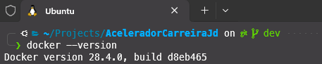
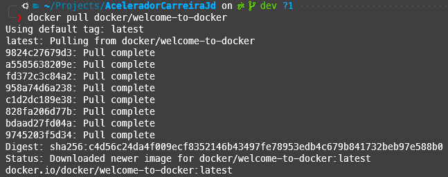
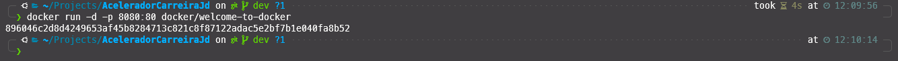
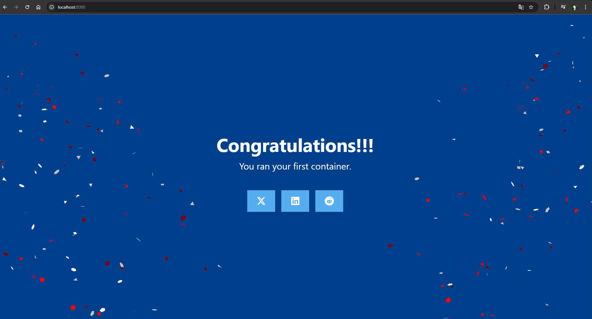

# Infra, Linux, Docker

## Introdução
Baseado no conteúdo da [Jornada de Dados](https://suajornadadedados.com.br/), com o Fundador e CEO, Luciano Vasconcelos.<br>
[Repositorio do Github](https://github.com/lvgalvao/workshop-docker-aovivo-)<br>
[Excalidraw](https://app.excalidraw.com/l/8pvW6zbNUnD/6MNAkqnvTPt)

## Docker
### Por que usar Docker?
- Facilita a criação, o deploy e a execução de aplicações usando containers.
- Permite que você empacote uma aplicação com todas as partes necessárias, como bibliotecas e outras dependências, e envie tudo como um único pacote.
- Garante que a aplicação funcione em qualquer outro ambiente, independentemente das configurações do sistema operacional ou das dependências instaladas
- Isolamento: Cada container é isolado dos outros, o que significa que você pode executar múltiplas aplicações no mesmo host sem conflitos.
- Portabilidade: Containers podem ser executados em qualquer lugar, desde o laptop de um desenvolvedor até servidores na nuvem.
- Eficiência: Containers compartilham o kernel do sistema operacional, o que os torna mais leves e rápidos do que máquinas virtuais tradicionais.
- Escalabilidade: Facilita o escalonamento de aplicações, permitindo que você aumente ou diminua o número de containers conforme a demanda.
- Consistência: Garante que a aplicação funcione da mesma maneira em diferentes ambientes, desde o desenvolvimento até a produção.
- Facilidade de gerenciamento: Ferramentas como Docker Compose e Kubernetes facilitam o gerenciamento de múltiplos containers e serviços.

### Histórico do Docker
- Servidores -> Caros e difíceis de escalar ($$$$)
- Motivação -> aproveitamento de recursos
- Docker Surgimento -> 2013 -> complemento a Virtualização -> Utilização do Computador da melhor forma possível.

VM + Pesada x Docker
Docker é focado em Aplicação. 

### Como Instalar o Docker?
- Linux (Ubuntu)
```bash
sudo apt-get update
sudo apt-get install \
    ca-certificates \
    curl \
    gnupg \
    lsb-release -y
sudo mkdir -p /etc/apt/keyrings
curl -fsSL https://download.docker.com/linux/ubuntu/gpg | sudo gpg --dearmor -o /etc/apt/keyrings/docker.gpg
echo "deb [arch=$(dpkg --print-architecture) signed-by=/etc/apt/keyrings/docker.gpg] https://download.docker.com/linux/ubuntu \
  $(lsb_release -cs) stable" | sudo tee /etc/apt/sources.list.d/docker.list > /dev/null
sudo apt-get update
sudo apt-get install docker-ce docker-ce-cli containerd.io docker-buildx-plugin docker-compose-plugin
```

- Windows
https://docs.docker.com/desktop/install/windows-install/

- Mac
https://docs.docker.com/desktop/install/mac-install/

### Tutorial Básico do Docker

No exemplo, o Luciano está utilizando o Docker Desktop no Windows. Aqui vou reproduzir os passos usando o Linux (Ubuntu 24.04), com uma imagem no WSL.

- Verificar a versão do Docker
```bash
docker --version
```


- Rodar um container com a imagem do welcome-to-docker
```bash
docker pull docker/welcome-to-docker
```


```bash
docker run -d -p 8080:80 docker/welcome-to-docker
```


Abra o navegador e acesse http://localhost:8080


No Docker, executa um Container e o Sistema Operacional dele é o Linux.

Para pegar outras imagens, acesse o Docker Hub: https://hub.docker.com/

- Listar os containers em execução
```bash
docker ps
```

### Hello World do Docker

1) Determine sua versão de Python
```bash
python3 --version
```
2) Crie seu ambiente virtualizado, no nosso caso, usando o Poetry.
```bash
